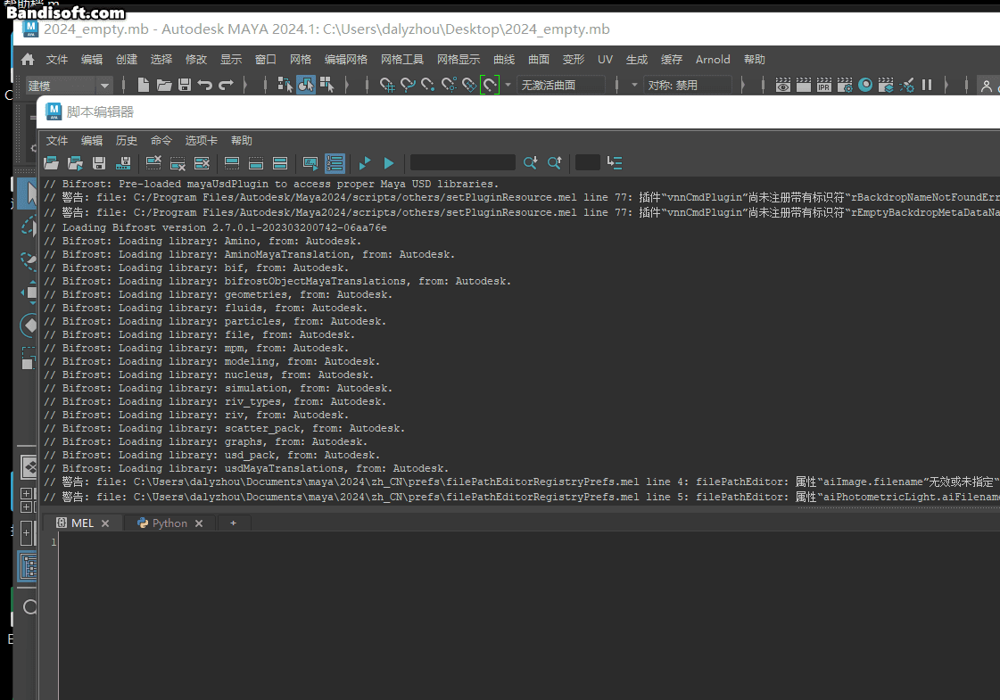
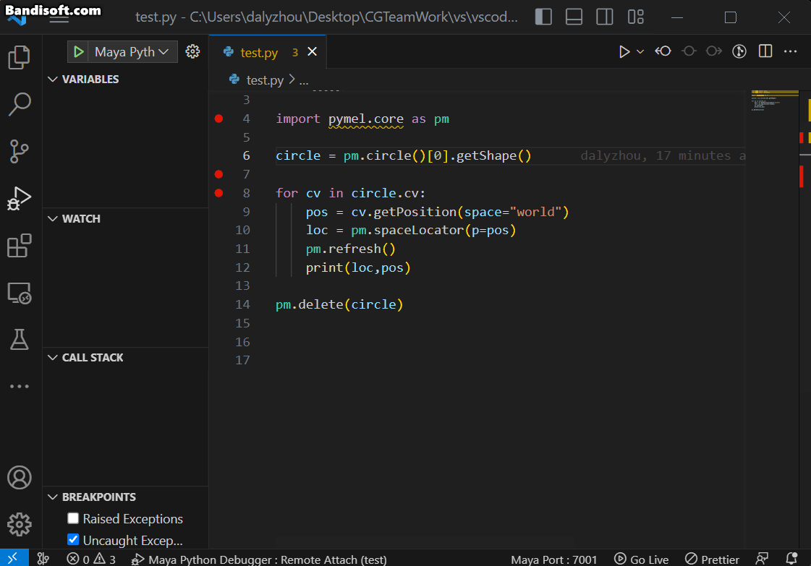
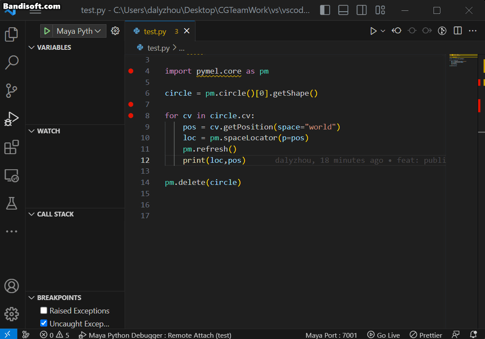
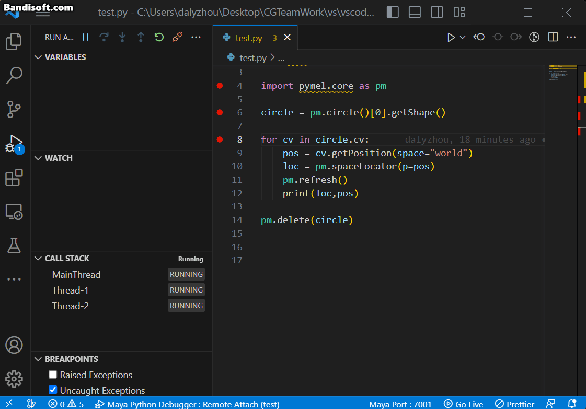
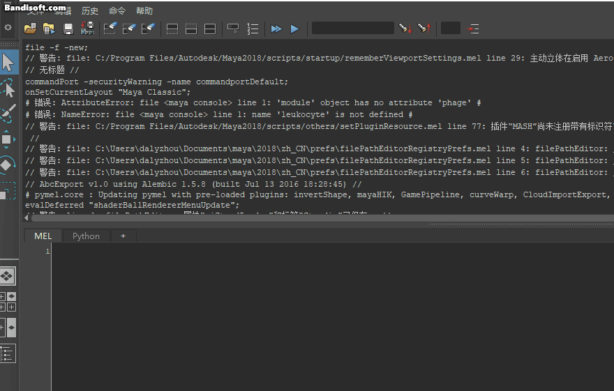
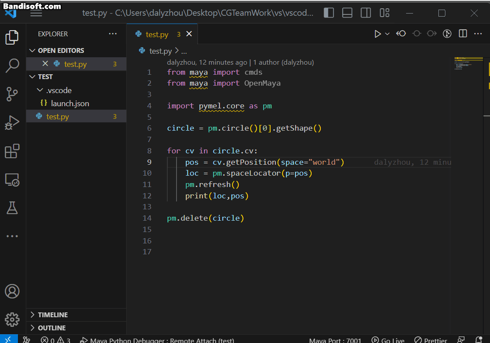
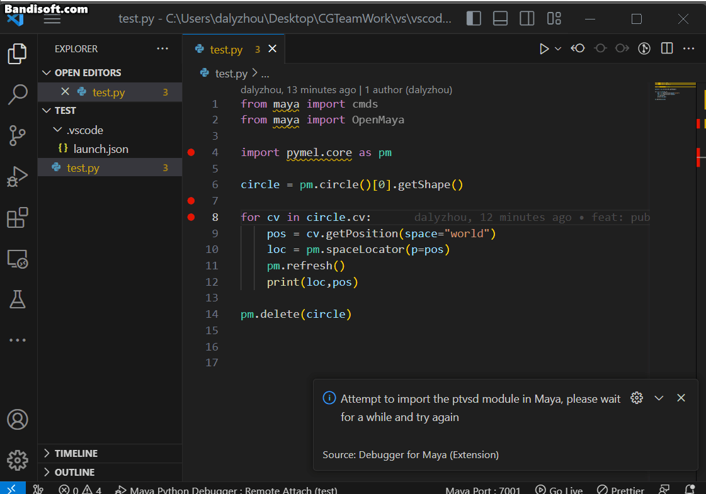
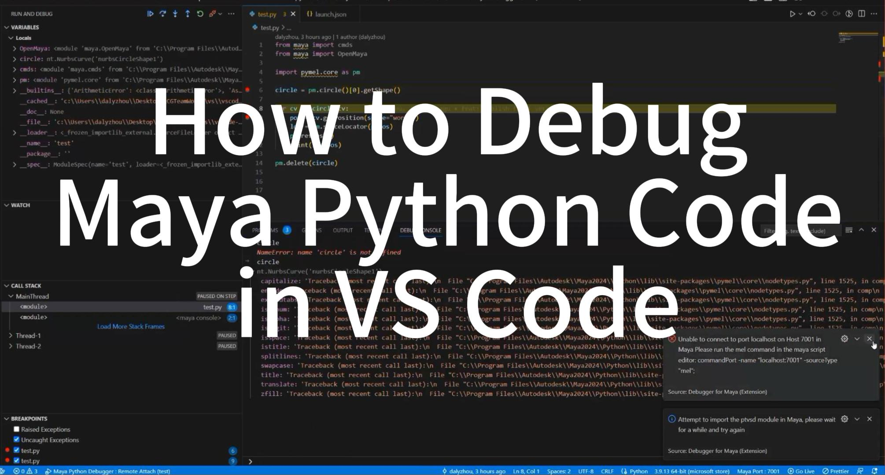

## Project Introduction

VS Code Extension for Autodesk Maya Python Debugging

## Usage

### 1. Debugging in versions greater than or equal Maya 2022.

#### 1.1 Open Maya and configure the Mel script
```mel
commandPort -name "localhost:7001" -sourceType "mel";
```


#### 1.2 Start Debugger Listen: Right-click ->"Debug Current Python File in Maya (>=2022)"


#### 1.3 Launch the vscode debugger
```json
{
    "version": "0.2.0",
    "configurations": [
        {
            "type": "python",
            "request": "attach",
            "name": "Maya Python Debugger : Remote Attach",
            "port": 5678,
            "host": "localhost",
            "pathMappings": [
                {
                    "localRoot": "${fileDirname}",
                    "remoteRoot": "${fileDirname}"
                }
            ],
            "MayaDebugFile": "${file}"
        },
    ]
}
```


#### 1.4 Start Debugging:  Right-click ->"Debug Current Python File in Maya (>=2022)"



### 2. Debugging in versions less than or equal to Maya 2011.

#### 2.1 Open Maya and configure the Mel script
```mel
commandPort -name "localhost:7001" -sourceType "mel" -echoOutput;
```


#### 2.2 Start Debugger Listen: Right-click ->"Debug Current Python File in Maya (<=2021)"


#### 3.3 Start Debugging:  Right-click ->"Debug Current Python File in Maya (<=2021)"


## Video Guide

[](https://www.youtube.com/watch?v=mIKi2tZP0JM)


## Reference VSCode Plugins
  
* [mayaCode](https://marketplace.visualstudio.com/items?itemName=magicstack.MagicPython) - A Visual Studio Code extension with support for coding for Maya.
* [MayaPy](https://marketplace.visualstudio.com/items?itemName=FXTD-Odyssey.mayapy) - A Visual Studio Code extension with Autodesk Maya Python Intellisense and Debugging/

## Reference Article

---
https://gist.github.com/joaen/bdc154ecb3f28d8481b9fb23411d1008

https://zenn.dev/gacha0923/articles/vscode-connect-to-maya_debugpy 

https://www.aleksandarkocic.com/2020/12/25/debugging-in-maya-with-debugpy-and-vscode/

https://zhuanlan.zhihu.com/p/615473758 

https://namination.co.uk/maya-remote-debugging-with-visual-studio-code/

https://qiita.com/Tack2/items/bf866950dc1f4d6e1c14